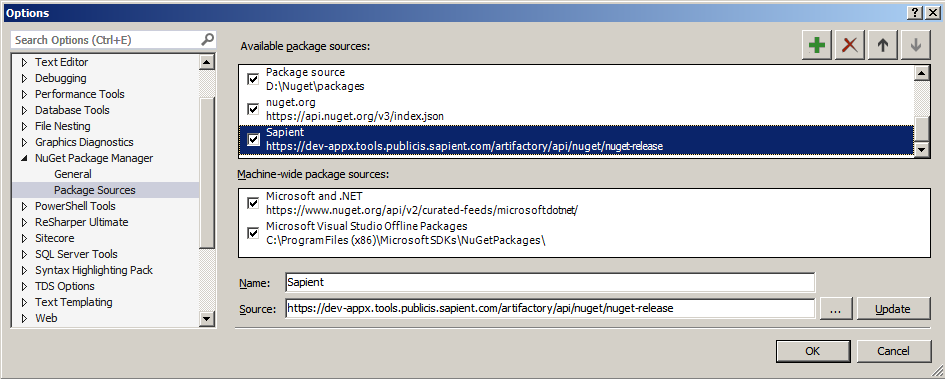
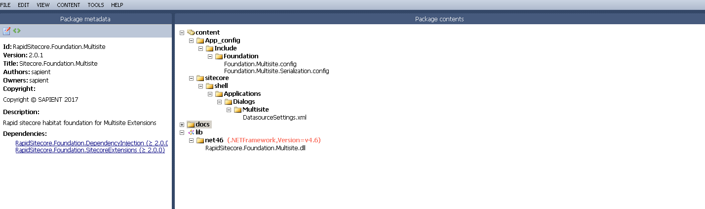
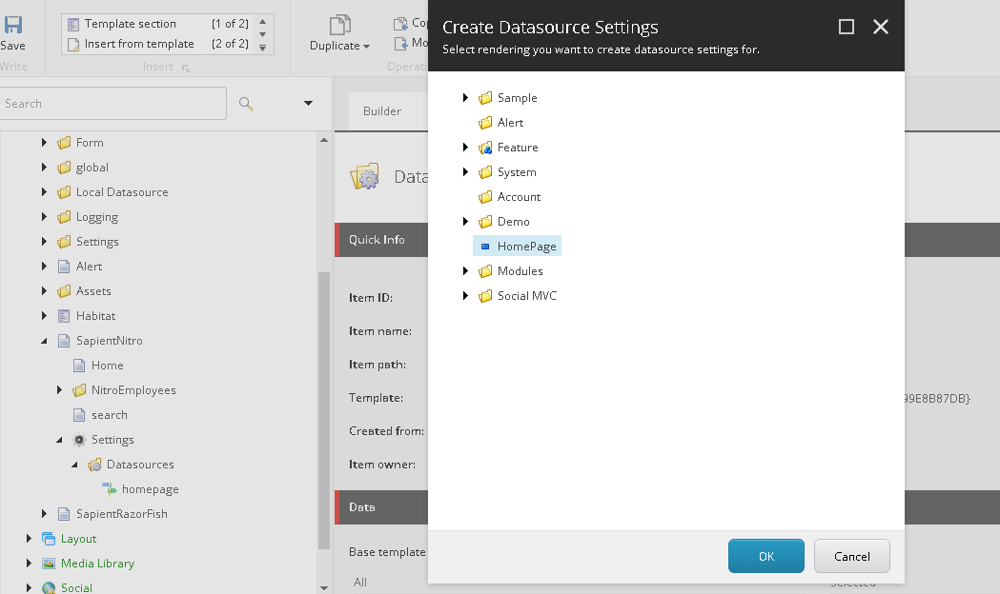
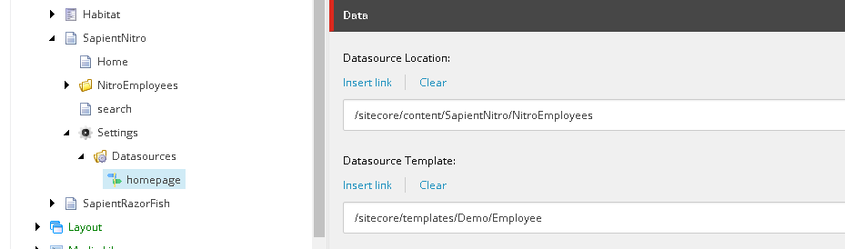

# Foundation.Multisite

This Project address the issues related to multiple sites hosted in Single sitecore instance and all sites using
 same Templates and Renderings.

When content author adding components to a page using Page Editor mode, each rendering asks for Data source. 
Rendering will have Field “Datasource Location” contains the path to Data sources. In case of Multisite 
environment, this path will change for site to site. In order to avoid this issue, need to add custom processor to 
<getRenderingDatasource> Pipeline. This processor resolves site specific data source location. 
 

Package Details
----------------

Package name : FWD.Foundation.Multisite

1. Configure a new package source to refer FWD Nuget packages.

2. Mention this URL : https://dev-appx.tools.publicis.sapient.com/artifactory/api/nuget/nuget-release
3. Browse and install the package in the project.

Package Content
-----------------

## How to use 
 
This is explained in below example for one of the rendering.

Create Content tree structure like this format: SITEROOT-> Settings-> Datasources

Settings item should be created using "{4C82B6DD-FE7C-4144-BCB3-F21B4080568F}" template.

And Datasources item should be created using "{7A98BE60-9F59-4064-82C2-58DA63562FA5}" template.

Right click on Datasources folder, click on "Datasource Configuration" it will open up wizard, select rendering to which need to configure datasource location. Click "Ok".
It will create the datasource configuration for selected rendering. Configuration item is created with name based on text mentioned in "Datasource Location" field of renderings.
For example: If "site:homepage" is the text mentioned in renderings then Configuration item will be created using "homepage".

When page editor resolving data source location, “site:homepage” will replaced with Context Site Contentsource path which is mentioned in Datasource location field of configuration item.
 
 ## Do's and Don't

 1) All the datasource configuration items should be created under “SITEROOT/Settings/Datasources” folder. Settings and Datasources items should be created using above mentioned template IDs.
 And value “Datasource Location” field in the rendering should be like “site:<CUSTOM_CONFIGURATION_NAME>”.

 2) Site root item should be inherited from "_Site"({BB85C5C2-9F87-48CE-8012-AF67CF4F765D}) template.

 

 ## Extension

	NA
