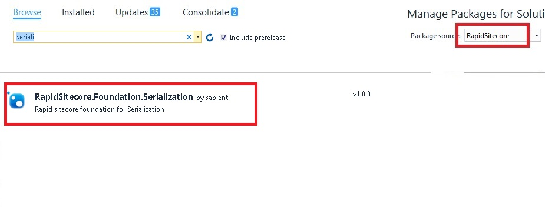
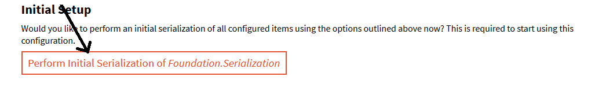
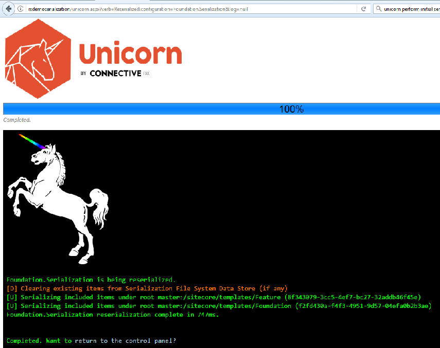
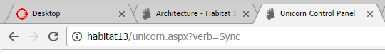
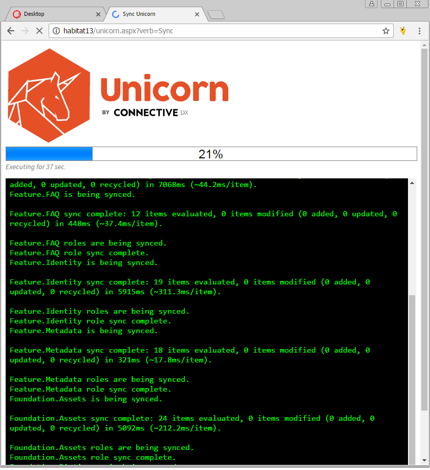
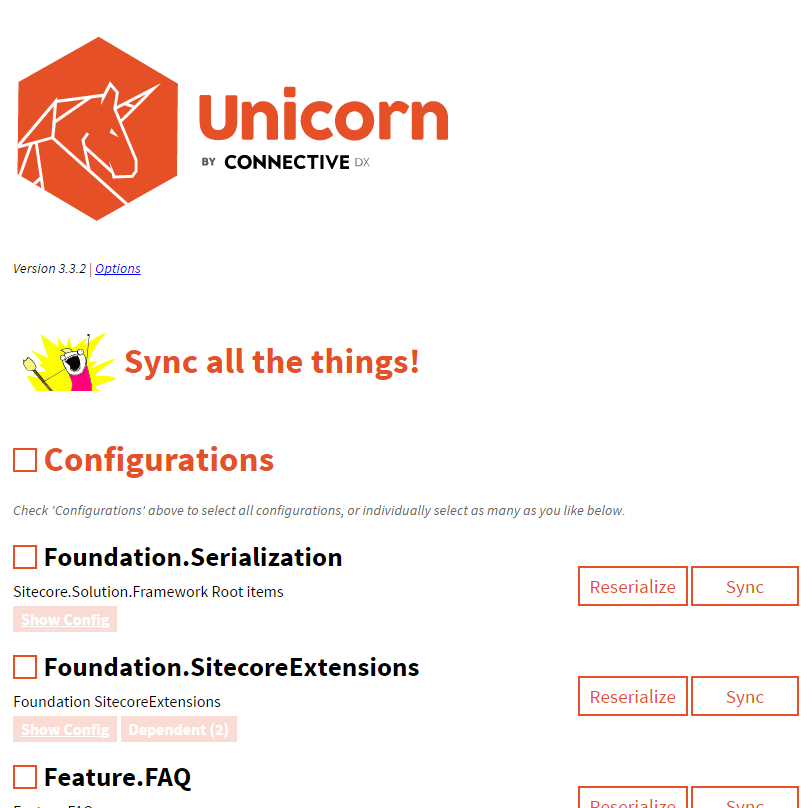
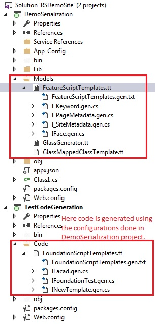
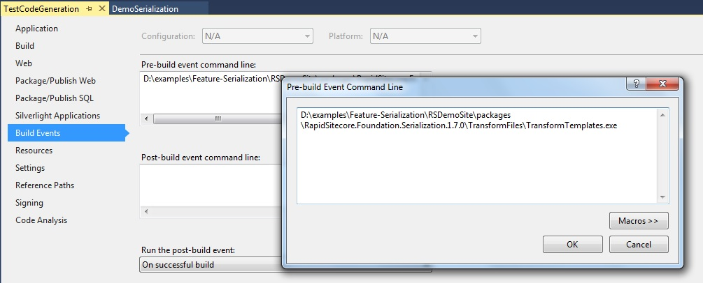


Serialization with Unicorn and Code Generation 
==============================================

Unicorn is a utility for Sitecore that solves the issue of moving templates, renderings, and other database items between Sitecore instances. This becomes problematic when developers have their own local instances - packages are error-prone and tend to be forgotten on the way to production. Unicorn solves this issue by using the Serialization APIs to keep copies of Sitecore items on disk along with the code - this way, a copy of the necessary database items for a given codebase accompanies it in source control.

This package also allows you to generate interfaces/classes based on your Sitecore template structure and the serialized templates generated using Unicorn. This uses T4 templates for generating the files. The T4 Toolbox is used to generate multiple files.

By default, it supports generating interfaces that are decorated with Glass Mapper attributes. But the T4 templates can be easily modified for other mapping/wrapping frameworks.

The T4 templates that supports code generation are:

 1. **GlassGenerator.tt** - The central class that actually uses Sitecore.CodeGenerator.DLL to read the serialized data and then creates the individual generated files.

 2. **GlassMappedClassTemplate.tt** - Individual template for what the generated files should look like. If you need to customize the code that needs to be generated, this is the first place to look.

 3. **SampleScriptTemplates.tt** - You can make as many copies of this as you like, for different groups/folders of templates. The generated files will show up as children of this item in the Solution Explorer.


### How to use

#### Installing NuGet package

1. Adding FWD package source
	1. In Visual Studio, go to Tools-> Nuget Package Manager-> Package Manager Settings
	2. In the dialog that opens, add URL: https://dev-appx.tools.publicis.sapient.com/artifactory/api/nuget/nuget-release
	
	

2. Open "Manage Nuget Packages..." by right clicking on your Visual Studio project/solution.

3. Select "FWD" as package source and add **FWD.Foundation.Serialization** package.

	


Please note that Foundation.Serialization has following dependencies. These will be automatically installed.

```
  <package id="Rainbow" version="1.4.1" targetFramework="net452" />
  <package id="Rainbow.Core" version="1.4.1" targetFramework="net452" />
  <package id="Rainbow.Storage.Sc" version="1.4.1" targetFramework="net452" />
  <package id="Rainbow.Storage.Yaml" version="1.4.1" targetFramework="net452" />
  <package id="Unicorn" version="3.3.2" targetFramework="net452" />
  <package id="Unicorn.Core" version="3.3.2" targetFramework="net452" />
  <package id="Unicorn.Roles" version="3.3.2" targetFramework="net452" />
  <package id="Unicorn.Roles.Core" version="3.3.2" targetFramework="net452" />
  <package id="Unicorn.Users" version="3.3.2" targetFramework="net452" />
  <package id="Unicorn.Users.Core" version="3.3.2" targetFramework="net452" />
```

#### Setting up project

1.	Install nuget package **FWD.Foundation.Serialization** (refer section *Installing NuGet package*) and publish the dependent assemblies to the bin folder of your local Sitecore instance.

2.	In **Foundation.Serialization.config** within the App_Config/Include/Foundation folder, give the **sourceFolder** path where you want to keep your serialized files.

```	
	<sc.variable name="sourceFolder" value="D:\examples\Feature-Serialization\RSDemoSite" />
```	

3.	Also edit the config to provide items that are to be included and excluded from Serialization. These items will only be synced using Unicorn and can be used to generate code.

    See below example, where Feature and Foundation templates are included for serialization.

```	
	 <!-- Templates -->
<include name="Foundation.Serialization.Templates.Feature" database="master" path="/sitecore/templates/Feature"></include>
<include name="Foundation.Serialization.Templates.Foundation" database="master" path="/sitecore/templates/Foundation"></include>
```

4. Build\deploy the updated config file.

5. Now, to start serializing the items using Unicorn, we defined in our config file, use your browser and enter your Sitecore site URL and add /unicorn.aspx to it. Initialize serialization.

(Ex. yoursite/unicorn.aspx)



6. You should see the beautiful Unicorn serialization page.
 


7. Verify that the serialized items were written to disk in the folder path mentioned in step 2. These items are structured the same way as they are in your Content Tree.

8. When Unicorn is finished you can click on the back to control panel button which is where we started. Click on Sync. This will synchronize all data into your site.

9.	Within the Unicorn folder you will see a Default-Configuration folder and within that you will begin to see your serialized Sitecore items. 

10.	Now we can test the Syncing. Open up your content editor and change the name of one of the Sitecore Items that was serialized. After that, go back to the Unicorn folder and like the magic of the Unicorn the name of the file on the disk was changed as well. 


**Syncing All Configurations with Sitecore Unicorn**
 
Unicorn will show you a "Sync All The Things" button, and checkboxes to let you choose multiple configs to sync at once, but those are only present when there are Multiple Configurations, all configurations have serialized items, and all configurations have valid root paths. All three conditions do not always occur, and, most frustratingly, usually don't occur when you want the "sync all" option the most: when you first setup a solution.

**This workaround, is just adding "?verb=Sync" to the Unicorn URL, and it'll perform all of the syncs, as if you clicked the "Sync all the things" button.**


 
To use the workaround, just type (or copy the above text) into your browser, and hit enter. Then, like magic, everything syncs. Unicorn figures out the order that things need to be synced in (based on dependencies) and anything with errors is handled just fine.







### Code Generation

**Pre-requisite:** Follow above steps to generate serialized files for Sitecore Templates.

1. Install the T4 Toolbox Visual Studio extension. (link- https://marketplace.visualstudio.com/items?itemName=OlegVSych.T4ToolboxforVisualStudio2015)

2. Copy the following DLLs to a folder that is within reach from your project (no need to add a reference; a dependency within your project isn't needed).

> * Glass.Mapper.Sc.dll [already comes with NuGet package, see Lib folder in your project]
> * Sitecore.CodeGenerator.dll [already comes with NuGet package, see Lib folder in your project]
> * Rainbow.dll [already comes with NuGet package, see Lib folder in your project]
> * Rainbow.Storage.Yaml.dll [already comes with NuGet package, see Lib folder in your project]
> * Sitecore.Kernel.dll


3. Notice the .tt files in Models folder. The files are GlassGenerator.tt, GlassMappedClassTemplate.tt and SampleScriptTemplates.tt.

4. Change the file references at the top of these files to correctly reference the Sitecore.Kernel.DLL, Sitecore.CodeGenerator.DLL, Rainbow.dll, Rainbow.Storage.Yaml.dll  and Glass.Mapper.Sc.DLL files.

5. In **GlassGenerator.tt**, change the following code so the path references your serialized data. The path is relative to the location of the .tt files.

``` c#
var solutionPath = Context.Host.ResolveAssemblyReference("$(SolutionDir)");

//Set the default serialized folder path here

var defaultPath = solutionPath+@"\foundation\serialization\serialization";
```

6. **SampleScriptTemplates.tt** - You can make as many copies of this file with a name of your choice at any location in your Visual Studio even outside of the project where NuGet Package is installed, for different groups/folders of templates. 

7. In SampleScriptTemplates.tt, change the following code to override the default serialized folder path given in Step 5: 

``` c#
//var solutionPath = this.Host.ResolveAssemblyReference("$(SolutionDir)");
//var serializedTemplatePath = solutionPath+@"\serialization\test";
var serializedTemplatePath = string.Empty;
```

8. In SampleScriptTemplates.tt, change the following code to set the path(s) of the templates that you want to generate code for: 

``` c#
new [] { "/sitecore/templates/Feature" }
```

9. Make sure **Sitecore.Kernel** is referenced in your project. Install **Glass.Mapper.Sc.Core** NuGet package.

10. Run the code generation either by right-clicking SampleScriptTemplates.tt and choosing "Run Custom Tool", or choosing "Build" > "Transform All T4 Templates".



#### Configure Automatic Code Generation

Once code generation is successfully running, you can configure it to auto-run as a pre-build event of your project:

1. Open project properties and provide the path of the **TransformTemplates.exe** that exists in *TransformFiles* folder under packages.

2. In **TransformTemplates.exe.config**, provide the *source* folder path and the tempaltes *.tt(SampleScriptTemplates.tt) path separated by semicolon.

3. On every build, the code is refreshed as a pre-build event.

Limitation- This may slow down the build process and hence this is not recommended. Refresh code files by right-clicking SampleScriptTemplates.tt and choosing "Run Custom Tool", or choosing "Build" > "Transform All T4 Templates". 



### Extension
The code generation can also be done for TDS with minor changes in T4 templates. The T4 templates can be easily modified for other mapping/wrapping frameworks, this module supports glassmapper. Refer helpful link for more details.


### Helpful link
https://github.com/hermanussen/sitecore.codegenerator

### Do's and Dont's

1. Correctly reference **sourcefolder** in **Foundation.Serialization.config**.

2. Carefully include and exclude items in **Foundation.Serialization.config**. Do not include Sitecore paths that aren't part of your Sitecore.

3. Initial serialization from Unicorn panel is necessary for serializing Sitecore Items.

4. Correctly reference all DLLs (mentioned in step 2 of Code Generation) in T4 templates.

5. Each time there is a change in Sitecore templates, code files need to be refreshed (step 10 of Code Generation) if auto-generation is not enabled on bild process.

6. For auto code generation, provide the path of tt files of type SampleScriptTemplates.tt only.

7. Do not make any changes in generated code files as they may get overwritten next time the code refreshes.

 

 


