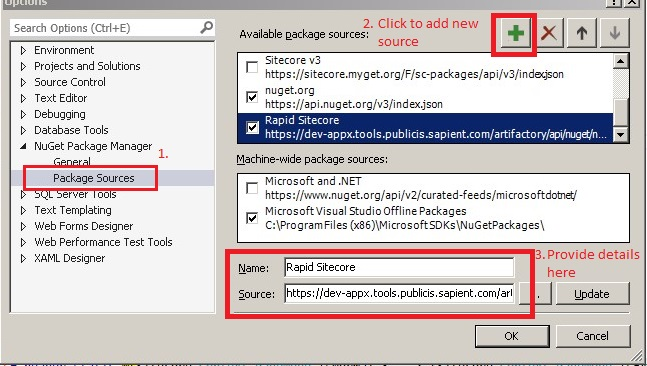
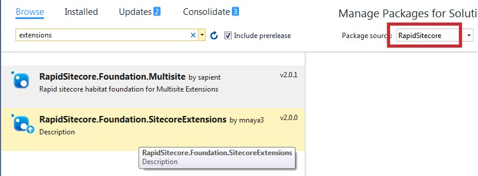

FWD.Foundation.Extensions
===================================

This project provides Extension methods for some of the Sitecore/ASP.NET MVC classes. Some of them are listed below.

1.	**Field Extensions**: This class contains all the extension methods of Sitecore Field class. Some of the methods are listed below
    
	a. ImageUrl : Returns image url for Sitecore Image Field.

2.	**HTML Helper Extensions**: This class contains extension methods of Sitecore HTML helper class. Some important methods are listed below.
    
	a. BeginEditFrame: Returns the edit frame renderings
    
	b.	DynamicPlaceholder: Add the dynamic placeholder.

3.	**Item Extensions**: This class contains extension methods of Sitecore item class.
    
	a.	Url: Returns user friendly url of an item.
    
	b.	ImageUrl: Returns image url of an image present in an item. Takes Image Field Id as Parameter.

4.	**Rendering Extension**: This class contains the extension methods of Sitecore rendering class.
    
	a.	GetIntegerParameter: Returns the value of rendering parameter as integer.

5.	**Session Extension**: This class contains the extension methods of HTTP Sessions.
    
	a.	GetAndRemove : Get and Remove the value from HTTP session for a particular key.

6.	**SiteExtension**: This class contains the extension methods of SiteContext class.
    
	a.	GetRootItem: Returns the root item from Sitecontext
    
	b.	GetStartItem: Returns the start item from sitecntext.

### How to use

#### Installing NuGet package
1. Adding FWD package source
	1. In Visual Studio, go to Tools-> Nuget Package Manager-> Package Manager Settings
	2. In the dialog that opens, add URL: https://dev-appx.tools.publicis.sapient.com/artifactory/api/nuget/nuget-release
	
	

2. Open "Manage Nuget Packages..." by right clicking on your Visual Studio project/solution.

3. Select "FWD" as package source and add **FWD.Foundation.SitecoreExtensions** package.

	

Please note that Foundation.SitecoreExtensions has following dependencies. These will be automatically installed.
> * FWD.Foundation.Dependencyinjection

#### Setting up project

1. Install nuget package **FWD.Foundation.SitecoreExtensions** (refer section *Installing NuGet package*)and publish the dependent assemblies to the bin folder of your local Sitecore instance.

2. Use Extension methods provided by this component in your project.

## Do' and Don’t: 
NA

## Extension: 
This project provides some of general extension methods. We can add new extension methods to respective class files.
