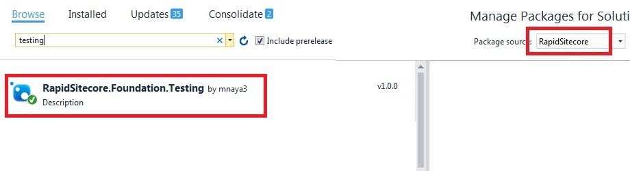

Foundation.Testing
==================

Unit Testing is a level of software testing where individual units/ components of a software are tested. The purpose is to validate that each unit of the software performs as designed.
> * A unit is the smallest testable part of software. 
> * It usually has one or a few inputs and usually a single output.
> * In object-oriented programming, the smallest unit is a method.

Unit Tests in FWD are developed as Arrange-Act-Assert and uses the following modules:
1. **xUnit** (https://xunit.github.io) framework as the main unit testing framework.

> xUnit.net is a free, open source, community-focused unit testing tool for the .NET Framework. xUnit.net works with ReSharper, CodeRush, TestDriven.NET and Xamarin.

2. **NSubstitute** (http://nsubstitute.github.io/) for mocking objects.

> There are several great mocking frameworks available for .Net, but NSubstitute stands out because of its simple and elegant syntax. Perhaps the biggest benefit is how easy it is to integrate mocked objects with the code under test. There is no need for framework specific bootstrapping, or extra properties to access the objects you are mocking.

3. **AutoFixture** (https://github.com/AutoFixture/AutoFixture) for “Arranging” the unit tests.

> AutoFixture is an open source library for .NET designed to minimize the 'Arrange' phase of your unit tests in order to maximize maintainability. Its primary goal is to allow developers to focus on what is being tested rather than how to setup the test scenario, by making it easier to create object graphs containing test data. 

4. **FluentAssertions** (http://www.fluentassertions.com/) for the assertion syntax.

> This open-source project provides good assertion framework for the .NET test frameworks like MSTest, MSTest2, NUnit, xUnit, xUnit2, MSpec, NSpec, MBUnit etc.

5. **FakeDb** (https://github.com/sergeyshushlyapin/Sitecore.FakeDb) for faking Sitecore objects and services.

> This is the unit testing framework for Sitecore that enables creation and manipulation of Sitecore content in memory. It is designed to minimize efforts for the test content initialization keeping focus on the minimal test data rather than comprehensive content tree representation.

## FakeDb with AutoFixture
Sitecore FakeDb provides a list of AutoFixture customizations allowing developers to create instances of Sitecore classes using simple customizations.

1. **AutoDbCustomization** which instantiates Sitecore types such as Sitececore.Data.Database
2. **ContentItemCustomization** which adds auto-generated items to the database
3. **AutoNSubstituteCustomization** This customization turns AutoFixture into an Auto-Mocking Container. The mock instances are created by NSubstitute. 
4. **HtmlHelperBuilderCustomization** which initializes HtmlHelper instance
5. **RegisterViewToEngineBuilder** that registers Views
6. **HttpContextBuilderCustomization** which initializes HttpContext
7. **CoreDbCustomization** which initializes CoreDb instance


### How to use

#### Installing NuGet package
1. Adding FWD package source
	1. In Visual Studio, go to Tools-> Nuget Package Manager-> Package Manager Settings
	2. In the dialog that opens, add URL: https://dev-appx.tools.publicis.sapient.com/artifactory/api/nuget/nuget-release
	
	

2. Open "Manage Nuget Packages..." by right clicking on your Visual Studio project/solution.

3. Select "FWD" as package source and add **FWD.Foundation.Testing** package.

	

Please note that Foundation.Testing has following dependencies. These will be automatically installed. This saves a lot of time in setting up the test project.
> * AutoFixture
> * NSubstitute
> * Sitecore.FakeDb
> * FluentAssertions
> * xUnit


#### Setting up Test project
1. Create a test project.

2. Install nuget package **FWD.Foundation.Testing** (refer section *Installing NuGet package*)and publish the dependent assemblies to the bin folder of your local Sitecore instance.

3. Add references to following assemblies:
	1. Lucene.Net.dll
	2. Sitecore.Analytics.dll
	3. Sitecore.Kernel.dll
	4. Sitecore.Logging.dll
	5. Sitecore.Nexus.dll 

4. Configure Sitecore license file- Open App.config and modify the 'LicensePath' setting to the license file location. This location can be a common project path or root of your test project.

5. Configure Database type- Starting from Sitecore 8.2, the Database type is changed from Sitecore.Data.Database to Sitecore.Data.DefaultDatabase. In the test project App.config file, ensure the proper type is selected:

```
<!-- DATABASE TYPE
     For Sitecore versions prior to 8.2 should be 'Sitecore.Data.Database, Sitecore.Kernel'.
     For Sitecore 8.2 and later should be 'Sitecore.Data.DefaultDatabase, Sitecore.Kernel'. -->
<sc.variable name="databaseType" value="Sitecore.Data.DefaultDatabase, Sitecore.Kernel" />
```

6. Add reference to the project under test.

7. Create unit test cases. You can use **Custom AutoFixture attributes** defined in Foundation.Testing component to initialize basic dependencies such as  such as Sitececore.Data.Database, HtmlHelper, HttpContext.

	1. AutoDbData


``` c#
		/// <summary>
        /// Should return context item using AutoDbData attribute
        /// </summary>
        [Theory, AutoDbData]
        public void ShouldReturnContextItem(Item item, SitecoreRepository rep)
        {
            Sitecore.Context.Item = item;
            Item contextItem = rep.ContextItem();
            Assert.NotNull(contextItem);
            contextItem.ID.ShouldBeEquivalentTo(item.ID);
        }
```


2. CoreDb


``` c#
		/// <summary>
        /// Using CoreDb attribute to instantiate core db database
        /// </summary>
        [Theory,AutoDbData]
        public void GetCoreFieldTypes([CoreDb]Db db, SitecoreRepository rep)
        {
            Item fieldTypes=rep.GetCoreFieldTypes(db.Database);
            Assert.NotNull(fieldTypes);
        }
```


3. RegisterView


``` c#
		/// <summary>
        /// Using RegisterView Attribute
        /// </summary>
        [Theory]
        [AutoDbData]
        public void PageEditorError_EditMode_RenderErrorView([RegisterView("~/Views/PageEditorMessageView.cshtml")] IView view,string errorMessage, FakeSiteContext siteContext,  HtmlHelper helper)
        {
            //Arrange
            typeof(SiteContext).GetField("displayMode", BindingFlags.Instance | BindingFlags.NonPublic).SetValue(siteContext, DisplayMode.Edit);

            //Act
            MvcHtmlString result;
            using (new SiteContextSwitcher(siteContext))
            {
                result = helper.PageEditorError(errorMessage);

                //Assert
                view.Received().Render(Arg.Is<ViewContext>(v => v.ViewData.Model.As<InfoMessage>().Type == InfoMessage.MessageType.Error), Arg.Any<TextWriter>());
            }
        }
```
	

### Do's and Dont's
1. Do not create test cases for everything. Instead, focus on the tests that impact the behavior of the system.
2. Before fixing a defect, write a test that exposes the defect.
3. Write test cases that are independent of each other.
4. Each scenario (conditions, exceptions, behavior) should have separate unit tests.
5. Any dependencies to the Unit (Parameter or External calls) should be Faked/Stubbed.
6. Do not write unit tests for static and private methods. They should be tested though calling public instance method.
 